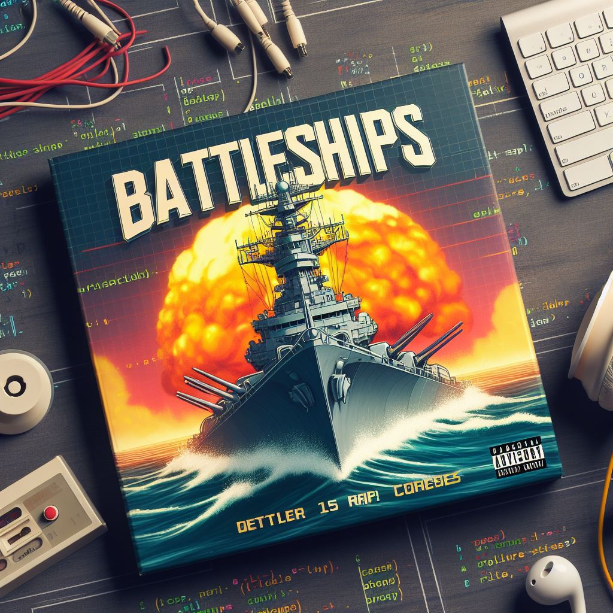
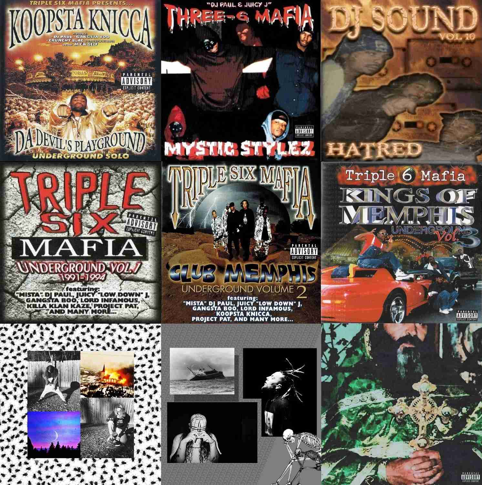

# Battleships 🚢💥
- A medium-large sized web-application done as the assignment for the college subject *Web Applications Development* ([DAW](https://github.com/isel-leic-daw/), [subject curricular unit](https://www.isel.pt/en/leic/web-application-development)) in the semester 22/23-winter. The assignment paper can be found [here p1](https://github.com/isel-leic-daw/s2223i-51d-51n-public/issues/1) & [here p2](https://github.com/isel-leic-daw/s2223i-51d-51n-public/issues/13) or in [docs](./docs/assignment-paper.md) in case it's deleted.
- Allows playing the Battleships game PvP with an account
- When creating a game, you can configure the types and number of each type of ship that's allowed, along with the time limits for configuring and the round of players. Rotating the ship is not supported, I didn't have time and it would be kinda hard for the way I made things work at the time

    

# Quick demo 🎥
TODO

# Run guide 🛠️
Since I made a bash script and I don't want to repeat what's there, see
- [build everything & run.sh](build%20everything%20&%20run.sh)

If you're on Windows you can use WSL to run script. Or convert it to a batch script with ChatGPT 🤷. And use the gradlew.bat

# Quick technical overview 📋
For the full details see [docs/README.md](./docs/README.md). Main docs:
- [back-end docs](./docs/back-end.md)
- [front-end docs](./docs/front-end.md)
## Programming Languages 🖥️
### Used in [back-end](./back-end/)
| Kotlin | PostgreSQL |
|:-:|:-:|
|  |  |

- As the build tool, I used Gradle with Kotlin DSL
### Used in [front-end](./front-end/)
| Typescript | HTML | CSS | 
|:-:|:-:|:-:|
|  |  |  |

## Frameworks 🧩
| Spring (for back-end) | React (for front-end) |
|:-:|:-:|
|  |  |

### Relevant libraries or tools used in back-end
- [JDBI](https://jdbi.org/) (built on top of JDBC), used to interact with the PostgreSQL database
- [Jackson JSON parsing](https://github.com/FasterXML/jackson), a JSON parsing library (similar to Google's `gson`), used to store some lists of complex objects into a JSON string in the database
## Recommended editors/programs to use 🔌
- **IntelliJ** (for back-end)
- **Visual Studio Code** (for front-end)
- [vscode-icons](https://marketplace.visualstudio.com/items?itemName=vscode-icons-team.vscode-icons) extension, for much better work-directory visuals in front-end
- **pgAdmin 4** (for PostgreSQL database operations, testing and consultation)
- **Docker desktop**  to manage the deployment of the application into containers

## Deployment methods experimented with 🐋
- Docker (and docker compose)
- Microsoft Azure

## Trivia 🎓
### 1 - Evaluation / rating
- 1st season exam: 9.6/20
- 2nd season exam: 14.5/20
- Pratical assignment: 16
- Final note: 15
### 2 - The grind
- Done alone, due to some group complications, but gave me a lot of motivation and I learned a lot. So it was actually a very good thing for me
- Thank you professors Pedro Felix and Filipe Freitas for the help
- Done in the winter, which is a season I don't like very much for the lack of sun and the cold, but in a sense it helps me focus and calms my mind. At the same time, I did 2 other hard subjects: Introduction to Programming in the Web ([IPW](https://github.com/isel-leic-ipw/). 90% alone) and C language and Assembly (PSC, alone). **I grew a lot as a programmer in the winter semester of 2022.** I wished developing web-apps wasn't so pushed towards the end of the course...
- Thankfully, I had Three 6 Mafia and Svicideboys to dwell into this challenging semester. Music was very helpful for me in order to have the right mindset and energy. In some instances, the loneliness of this path and the expectation of great challenges to come while in the cold of these nights reminded that it all depended on me. To go long with this, the gangsta mindset coming from my favorite artists made me man up and put in work. When you see the code and this work, just know that I was bangin' memphis rap while doing it. Putting in work while in the cold study-rooms and in the darkness of winter. This is T6M, and specially Mystic Stylez, fueled & certified code 😤😈. Now, I'll continue this journey while Ridin' N' Da Chevy...

    

