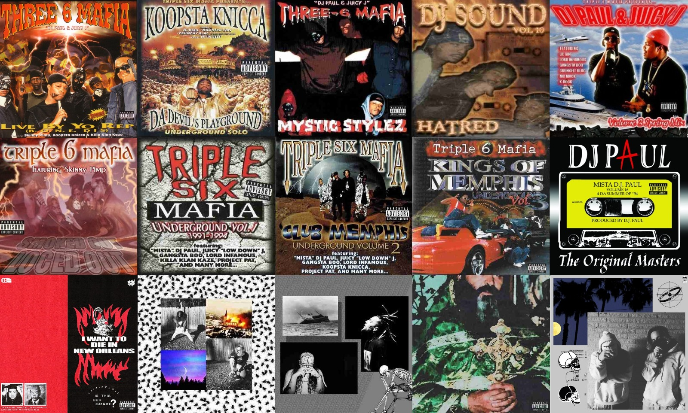

# About
- A medium-large sized web-application done as the assignment for the college subject *Web Applications Development* ([DAW](https://github.com/isel-leic-daw/), [subject curricular unit](https://www.isel.pt/en/leic/web-application-development)). The assignment and the repo of this semester (22-inv-23), can be found [here p1](https://github.com/isel-leic-daw/s2223i-51d-51n-public/issues/1) & [here p2](https://github.com/isel-leic-daw/s2223i-51d-51n-public/issues/13) or in [docs](./docs/assignment-paper.md) in case it's deleted.
- Allows playing the Battleships game PvP w/ an account
- When creating a game, you can configure the types and number of each type of ship that's allowed, along w/ the time limits for configuring and the round of players. Rotating the ship is not supported, I didn't have time and it would be kinda hard for the way I made things work at the time

    

# Quick demo
TODO

# Quick technical overview
For the full details see [docs/README.md](./docs/README.md). Main docs:
- [quick build & run guide](./code/README.md)
- [back-end docs](./docs/back-end.md)
- [front-end docs](./docs/front-end.md)
## Programming Languages
### Used in [back-end](./code/back-end/)
- Kotlin (& Gradle, with Kotlin DSL, as the build tool)
- PostgreSQL
### Used in [front-end](./code/front-end/)
- Typescript (transpiled to Javascript)
- HTML and CSS
## Frameworks
- Spring (for back-end)
- React (for front-end)
### Other relevant libraries or tools used in back-end
- [JDBI](https://jdbi.org/) (built on top of JDBC), used to interact with the PostgreSQL database
- [Jackson JSON parsing](https://github.com/FasterXML/jackson), a JSON parsing library (similar to Google's `gson`), used to store some lists of complex objects into a JSON string in the database
## Recommended editors/programs to use:
- **IntelliJ** (for back-end)
- **Visual Studio Code** (for front-end)
- [vscode-icons](https://marketplace.visualstudio.com/items?itemName=vscode-icons-team.vscode-icons) extension, for much better work-directory visuals in front-end
- **pgAdmin 4** (for PostgreSQL database operations, testing and consultation)
- **Docker** desktop to manage the deployment of the application

## Deployment methods experimented with
- Docker (and docker compose)
- Microsoft Azure

## Trivia
### 1 - Evaluation / rating
- 1st season exam: 9.6/20
- 2nd season exam: 14.5/20
- Pratical assignment: 16
- Final note: 15
### 2 - The grind
- Done alone, due to some group complications, but gave me a lot of motivation and I learned a lot. So it was actually a very good thing for me
- Thank you professors Pedro Felix and Filipe Freitas for the help
- Done in the winter, which is a season I don't like very much for the lack of sun and the cold. As a side effect, it "solidifies" my mind, but in some sense it helpes me focus. At the same time, I did 2 other hard subjects: Introduction to Programming in the Web ([IPW](https://github.com/isel-leic-ipw/). 90% alone) and C language and Assembly (PSC, alone). I grew a lot as a programmer in the winter semester of 2022
- Thankfully, I had Three 6 Mafia and Sv1c!d3boys to dwell into this challenging semester. Music is very helpful for me in order to have the right mindset and energy. In some instances, the evilish sounds in the cold of the night reminded that I was all in my own. In others instances, the gangsta mindset made me man up and put in work. When you see the code and this work, just know that I was bangin' memphis rap while doing it. Putting in work while in the cold and darkness of winter. All by myself in study-rooms. This is T6M, and specially Mystic Stylez, fueled & certified code 😤😈. Now, I'll continue this journey while Ridin' N' Da Chevy...

    

