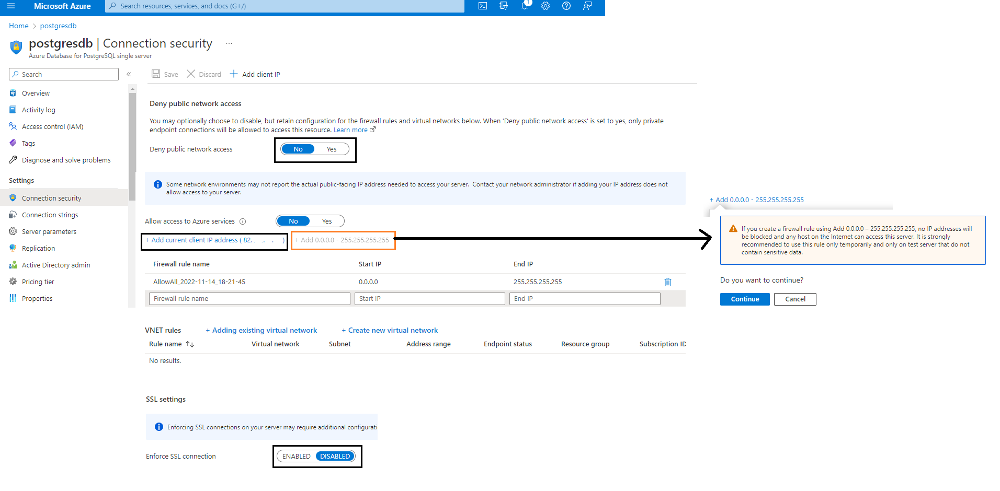

# How to publish this application to the internet
Some implementations were changed to adapt to the hosting platform.

## Requirements:
- Microsoft account
- Docker Hub account

## Using: Microsoft Azure -> App Service
### Implementation changes:
- Only 1 battle-service container at port 8080 because of [this](https://learn.microsoft.com/en-us/troubleshoot/azure/app-service/faqs-app-service-linux#how-do-i-know-which-container-is-internet-accessible-)
. Port 8080 and 80 is usually used for web servers
- Since I chose to not yet initialize the DB at the server level (when the server starts, I don't perform operations to create the DB), I won't use a container for postgresql. 
So I will have to use a Azure Database for PostgreSQL, which the container will have access. And the extra advantage is that I 
also have access using pgadmin4 (if the DB was inside the container I wouldn't have an address to access it)

(Optional if you wanna do commands throught cmd) -> Install Azure CLI (Comand Line Interface) [here](https://learn.microsoft.com/en-us/cli/azure/install-azure-cli-windows?tabs=azure-cli)

1. Create account. Using student account gives you 100$ in credit for 1 year of a certain cap of resoruces. [see](https://portal.azure.com/#view/Microsoft_Azure_Education/EducationMenuBlade/~/overview). 
Using free account gives you 12months of free use up to 200$ of a certain cap 
of resources. [see this](https://portal.azure.com/#view/Microsoft_Azure_Billing/FreeServicesBlade) and [this](https://azure.microsoft.com/pt-pt/free/)

2. Create [Azure Database for PostgreSQL](https://portal.azure.com/?l=en.en-us#create/Microsoft.PostgreSQLServer) (Flexible server)
- Note: Single server doesn't allow you to stop the server, flexible does allow [see](https://learn.microsoft.com/en-us/azure/postgresql/flexible-server/concepts-compare-single-server-flexible-server#:~:text=scale%20across%20tiers-,Stop/Start,-No)
- I compared the prices too, single server gives predictions of 139$ per month, flexible gives 19$
- Pretty straight-forward setup. Make sure you put the lowest memory, CPU, etc to lower price
- After doing it, in overview you can see the server name, which should end with `.postgres.database.azure.com` and the admin username.
You can go to Settings -> Connection strings and consult the varius URL's (depending on the program/language)
to connect to the DB, which will also indicate the port. Then set these settings so you can connect easily w/ pgadmin4
- After this, you can now set the JDBC_DATABASE_URL with in the docker or docker-compose file
- Before accessing the DB, you have to do this to make it accessible, althought IDK if it will be a safe connection


- After acessing throught pdadmin4, create the tables (if your server doesn't create them).
- You can go to Monotoring -> Metricts to see DB trafic
- In Settings -> Compute + Storage you can alter again the hardware/resources used and confirm the prices 
(in single server it's Settings -> Pricing tier)

3. Make sure YOUR server images have unique names. Like:
```yaml
services:
  battle-service-1:
    image: p4ulor/battle-service-compose-azure  # HERE!!!!! must be unique profile and name (among your repositories) to publish on your https://hub.docker.com/ profile
    container_name: battle-service-1
    hostname: battle-service-1
    ...
```
4. Build the images Version -> docker-compose
- docker-compose -f docker-compose-azure.yml build

Note: docker-compose references the file `Dockerfile`. It will create the image defined in that file. Meaning that image will
not have the env variables in docker-compose! Only at run time, when executing a docker compose file (like docker-compose-azure.yml) 
and starting a container w/ that image, it will inject the env variables for that container!

You are creating the image using docker-compose IF the image doesn't exist yet in docker hub. If it exists in docker hub, it will pull from it
And if it's not in docker hub, the `build:` field referencing the accessible Dockerfile is required.

After building, check if the image appears in docker-desktop (if it doesn't close the console window, and open docker-desktop again), 
Then, push it.
```
docker image push p4ulor/battle-service-compose-azure 
```
OR
```
docker compose -f docker-compose-azure.yml push
```
Pushing will store your containers in
docker's hub (cloud), which will be useful when the website/company that will host your containers will just pull from this repo when you push new versions.

4. Build the images Version -> Dockerfile
Alternatively, you can use `Dockerfile_azure`, where the env variables, port and other things are declared.
``` 
docker build -f Dockerfile_Dockerfile_azure . -t p4ulor/battle-service-azure:latest
docker push p4ulor/battle-service-azure:latest
```

`:latest` indicates the tag. You dont need to put it, if you don't it will always have the tag latest. 
And you need to have your username like `p4ulor/` if you wan't to push it

Note: When running a container, you can use [docker commands](https://www.baeldung.com/ops/docker-get-environment-variable)
to get the env variables avaiables from that image, so you shouldn't publish public images w/ env variables that contain your DB string which includes
username and password! **We can conclude with this that using docker-compose type deployment in azure CAN be safer because we can set private
env variables when we deploy the app**

Thus, it's recommended to use docker-compose-azure.yml w/ azure (the first version of this step 4), 
pass the env variables through the .yml file during the App Service creation (next step), and have your image
in docker hub without the env variables!

Note: After pushing your image, you can go to docker desktop -> images -> remote repositories and see that your repo is there

5. Check if the image is in docker hub and public (if you want private you'll have to pay, and on Azure you'll have to give credentials)

6. Create Resource [Web App](https://portal.azure.com/?l=en.en-us#create/Microsoft.AppSvcLinux) (NOT Web App for containers!)
- Pretty straight-forward. For the operating system select Linux. If you select Microsoft Windows doesn't have the docker compose option.
- Select either Single Container or Docker compose depending on what you chose on step 4. On Single container, just reference the image you
pushed. On Docker compose, you need to paste or upload your docker-compose-azure.yml file like it is (Im pretty sure per example that it's futile to
have the line "dockerfile: ./DockerfilePostgres"), which must reference the image
in docker hub! It might say that it started when you launch it, but you'll have to wait 10-15 minutes before it works

After starting the website (web app), you will note that in docker-hub, it will show that the image was pulled atleast 1 time .
In my case it shows a pull count of 2 IDK why. I guess that when docker desktop register my repo to "remote repositories" tab 
(after I do the first push) it counts has a pull?

After the deployment is done, make sure you turn the image to private on dockerhub, but next time you launch it, make it public again so azure can access it

Now, don't forget to stop the web app and then the postgres server! Note: When you stop the postgres "flexible server" it says that it "will start again after 7 days if you don't perform a manual start operation", ok lol.

## Resources and guides
- https://www.devteam.space/blog/how-to-deploy-a-web-app-with-docker-containers/
### Azure
- https://learn.microsoft.com/en-us/training/modules/host-a-web-app-with-azure-app-service/
- https://youtu.be/jC23hgGkdIM
- https://learn.microsoft.com/en-us/azure/container-instances/tutorial-docker-compose
- https://portal.azure.com/
- https://docs.docker.com/cloud/aci-integration/#running-compose-applications

### Google (I didn't try it out, but here's some resources)
- https://gist.github.com/phattv/a1cbe9400258bc6f1d0faf06a8d95c0a
- https://cloud.google.com/run
