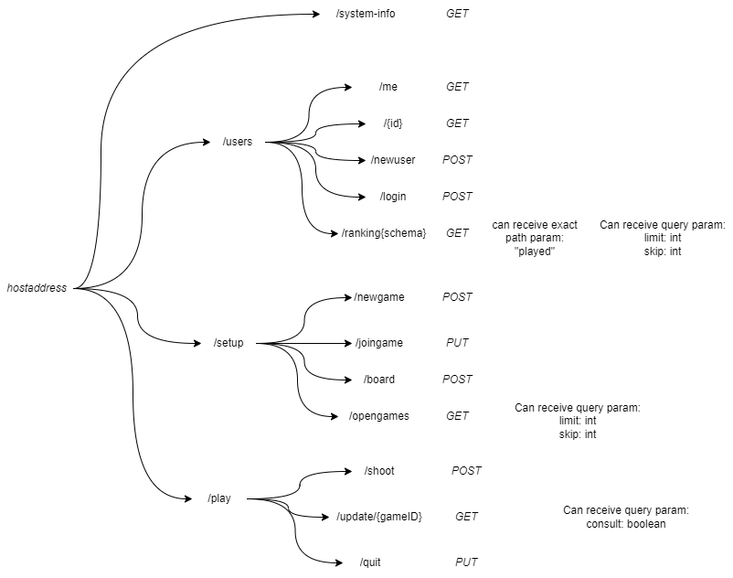
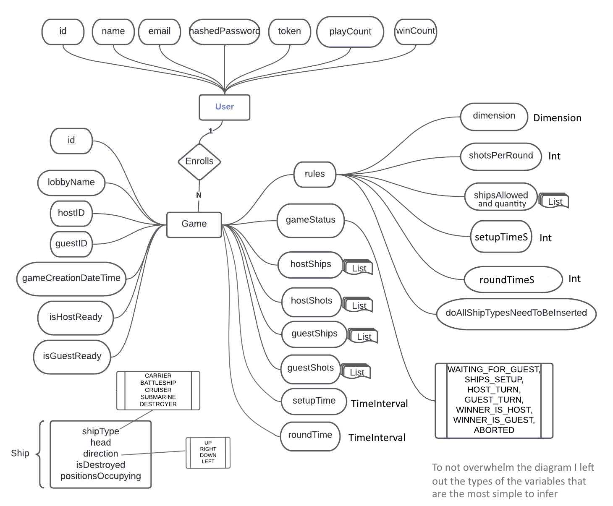
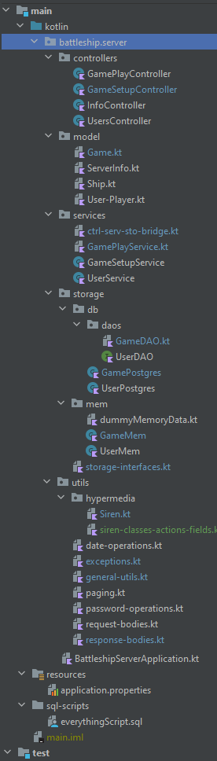

# Back-end documentation
## Operations implemented and data/game restrictions
### A user can:
- Create account by providing name, email and password
- A user can Log in with email or name and password
- See info of a user using an ID
- See info of the logged in user
### A game can be setup with authorized users:
- A game can be created
- Other users can query for the open games, obtaining their ID (and lobby name) they can request to join
- The guest user obtains the rules. The host will have to check if a guest joined
- The game enters a board setup phase
- After both users submit their boards, the host starts first
- After the apponents user round, the user can get an update of the state of his ships and the state of the game (win/loss)
- After a game is ended, both users can consult all the information of the game.
- After a game, the user stats (winCount and playCount) are updated

### Some details:
- The min and max coordinates are from 1 to 26
- The board has the min dimension of 2 and max 26. It doesn't need to be a square
- If the dimension of the board is smaller than the dimension of a ship, the ShipTypes allowed will be trimmed
- If the number of Ship slots are bellow a certain ratio with the dimensions of the board, the ShipTypes allowed will be trimmed
- The types of ships in each game is costumizable and the ammount of each one on a match has a minimum amount is 1 and the max of 5
- The min number of shots per round is 1 and max is 5
- Ships can't overlap and much have a free space around them
- A user can't shoot to a place he shoot before
- There are default values for all variables in case the client doesn't specify it
- A user can't be in a 2 ongoing games. 

## API diagram

## Modeling the database
## Conceptual model (Entity-Relationship) 

The following diagram is the Entity-Relationship model for the information managed by the system.

# Project structure

## **How and where command parameters are validated**
- Many validations are done at the level of the request body by using java and spring annonations. There are always informational messages about the reasons for each error.
- The model also has many validations, about ranges of numbers and types of variables.
- There are many checks throught each of the main 3 modules. Controllers checks for the authorization header, services does major checks about states and interprets data coming from the datasource. In rare cases where there's a storage error, the most proper message will be returned by interpreting the error or just depending on the situation

## Data Access
To run w/ data in memory, don't put program arguments

To run w/ postgres data w/ enviornment variable:
- postgres

To run w/ postgres data w/ custom URL:
- postgres jdbc:postgresql://localhost/postgres?user=postgres&password=password

## Paging
All get requests that can return large lists accept the query parameters `limit` and `skip`

## Error Handling/Processing
All error handling is done with the use the annonation @ControllerAdvice on a class that extends from ResponseEntityExceptionHandler and overrides some of the methods along with defining function with the @ExceptionHandler annonation and the type of exception to handle

## About hypermedia
Since I was doing this project alone and after I noticed that hypermedia would over-complicate the whole project I didn't do it. But here's some info about it.

- [A must read!](https://medium.com/apis-you-wont-hate/rest-and-hypermedia-in-2019-76cb3421e745)
- [Designing and Implementing Hypermedia APIs p1](http://www.infoq.com/articles/hypermedia-api-tutorial-part-one)
- [Designing and Implementing Hypermedia APIs p2](https://www.infoq.com/articles/hypermedia-api-tutorial-part-two/)
- https://github.com/kevinswiber/siren
