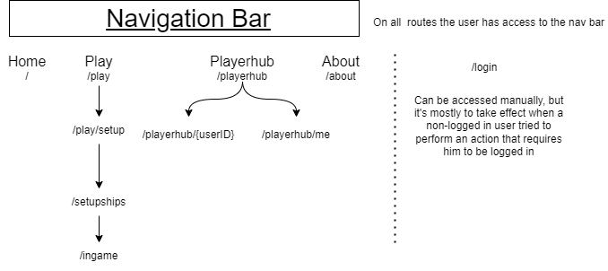

# Front-end documentation
# Dependecies list
###### Keep this equal to [this readme](../code/front-end/README.md)
- ### React
- [@types/react](https://www.npmjs.com/package/@types/react) -> Provides us with type definitions when calling React functions
- [@types/react-dom](https://www.npmjs.com/package/@types/react-dom) -> Provides us with type definitions when calling React functions
- [react](https://www.npmjs.com/package/react) -> Facilitates the creation of HTML pages, extending the syntax of JS (and is called JSX) that allows mixing between HTML and JS code. And some other things regarding UI. [see](https://github.com/isel-leic-daw/s2223i-51d-51n-public/blob/main/docs/lecture-notes/03.1.react.md)
- [react-dom](https://www.npmjs.com/package/react-dom) -> Provides DOM-specific methods to manipulate a HTML page
- [react-router-dom](https://www.npmjs.com/package/react-router-dom) -> Used for rendering or altering Components that are incorporated into the DOM when the page is navigated throughout it's use. [See](https://blog.webdevsimplified.com/2022-07/react-router/) and [this](https://www.youtube.com/watch?v=Ul3y1LXxzdU). This library is not officially from React, but it's great. It does it's thing by calling browser-DOM functions, per example: history. [docs](https://reactrouter.com/en/main)
#### Webpack
- [webpack-cli](https://www.npmjs.com/package/webpack-cli) -> For bundling AKA compressing the code. CLI -> Comand Line Interface, This version of webpack allows and expects a configuration file named `webpack.config.js` which allows for a more customizable build. Webpack compresses most of our files into 1 .js file. This will result in reduced GET requests of files, reduce network load in the initial HTTP request of the client and prevents reverse engineering or hacking.
- [webpack-dev-server](https://www.npmjs.com/package/webpack-dev-server) -> A server that auto bundles, when you change code, meant to be used during development. For avoiding doing `npm webpack` and refreshing the browser
- [style-loader](https://www.npmjs.com/package/style-loader) -> Inject CSS into the DOM
- [css-loader](https://www.npmjs.com/package/css-loader) ->  interprets @import and url() like import/require() and will resolve them.
- [html-webpack-plugin](https://www.npmjs.com/package/html-webpack-plugin) -> Plugin that simplifies creation of HTML files to serve your bundles. [See](https://webpack.js.org/plugins/html-webpack-plugin/)
- [file-loader](https://www.npmjs.com/package//file-loader) -> For loading images and sound files. [See](https://v4.webpack.js.org/loaders/file-loader/)
- [ts-loader](https://www.npmjs.com/package/ts-loader) -> Allows the use of/integrates webpack with typescript, [See](https://webpack.js.org/guides/typescript/)
### Typescript
- [typescript](https://www.npmjs.com/package/typescript) -> An extension to javascript, whose main purpose is to add types to the language. Which helps in avoiding errors during development

# Main challenges when coding
- State management
- Code organization & avoiding repetitive coding
- Pattern recognition while coding to learn how to use React and React Router

# Design decisions
## 1 - Code organization & framework components
## 1.1 - public/

## 1.2 - src/

## 1.3 - Relevant react tools / objects / functions used
- React.useEffect()
- React.useRef()
- React.useState()
- React.createContext() / React.useContext()
- ReactRouter.BrowserRouter
- ReactRouter.Route(s)
- ReactRouter.Link
- ReactRouter.Navigate
- ReactRouter.Location
- ReactRouter.Outlet
- ReactRouter.useParams()
## 2 - Website navigation

front-end-
## 2.1 - User interface
I tried making a simple, easy to look and transparent interface. Per example I show the name and lenght of the ship types, the positions and direction they were placed in, the position of the selected square, the name of the opponent, used big letters, I show when a fetch request is being done and what time is remaining to do a fetch request (during polling)

# Demonstration of the web application, from an end-user viewpoint
# Home

# Login

# About

# Login page and redirect

# Player hub (ranking and stats)

# Open games and create game

# Ships Setup

# Gameplay

## Notes during gameplay
- Every time a users shoots a shot, it resets the TimeInterval variable in storage. And there's a cyclic operation that's made with `ScheduledExecutorService` 
- On refresh the user gets all the info it needs form the API, like the currentTimerInEffect, the users ships, the users shots, gameStatus etc
that is running for each onGoing game. It's initially started when both the users are ready
- There are some occassional errors with the synching between the timers in the server and in the front-end by up to 10s
- Neither the /shipssetup route or /ingame route supports directly accessing to it, because it depends on states injected by ReactRouter.location

## About token storage
- Neither sessionStorage or localStorage are used to store user tokens. Since that data is vulnerable to Cross Site Scripting
- Cookies are used, which won't be possible to access using Javascript (when configured as 'HttpOnly'). The browser will then only allow the use of this cookie in fetch requests.
But the problem/hack called Cross Site Requet Forjery comes into play. But using the cookie parameter 'SameSite' in the cookie avoids this