# Front-end documentation
# Dependecies list
[See here](../front-end/README.md#dependencies-included)

# Main challenges when coding
- State management
- Code organization & avoiding repetitive coding
- Pattern recognition while coding to learn how to use React and React Router

# Design decisions
## 1 - Code organization & framework components
## 1.1 - public/
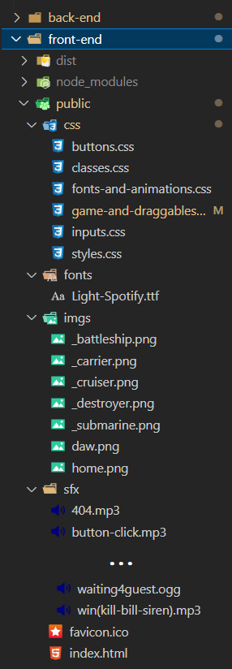
## 1.2 - src/
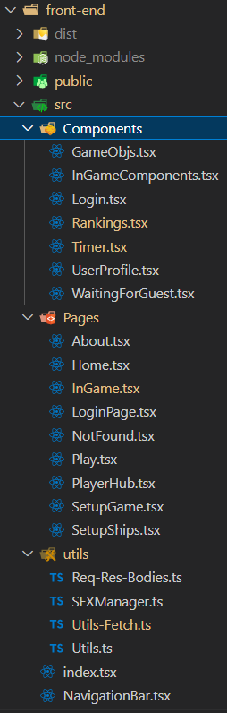
## 1.3 - Relevant react tools / objects / functions used
- React.useEffect()
- React.useRef()
- React.useState()
- React.createContext() / React.useContext()
- ReactRouter.BrowserRouter
- ReactRouter.Route(s)
- ReactRouter.Link
- ReactRouter.Navigate
- ReactRouter.Location
- ReactRouter.Outlet
- ReactRouter.useParams()
## 2 - Website navigation
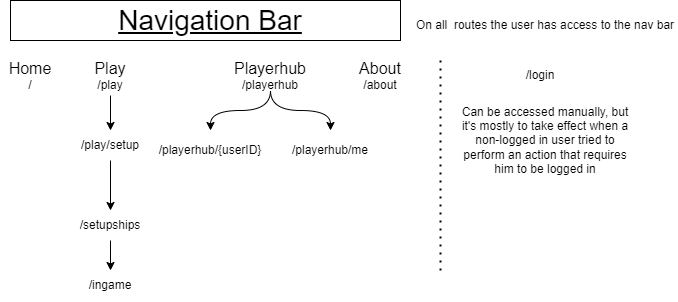
front-end-
## 2.1 - User interface
I tried making a simple, easy to look and transparent interface. Per example I show the name and lenght of the ship types, the positions and direction they were placed in, the position of the selected square, the name of the opponent, used big letters, I show when a fetch request is being done and what time is remaining to do a fetch request (during polling)

# Demo of the web application
## Home
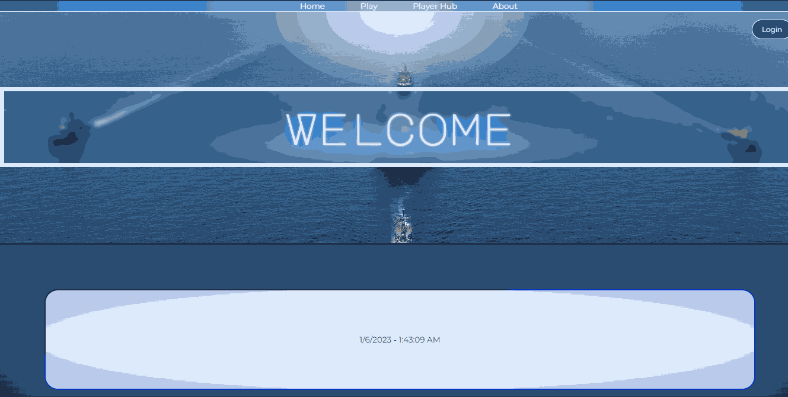
## Login
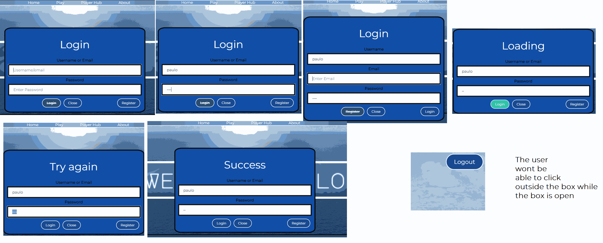
## About
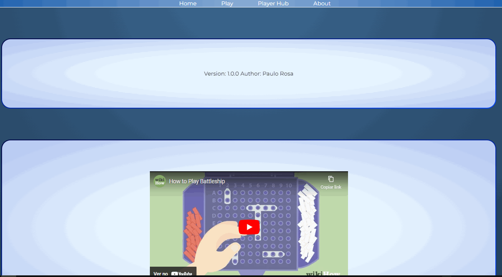
## Login page and redirect
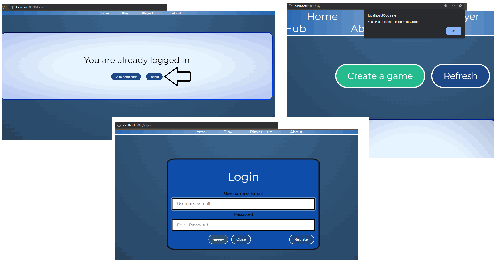
## Player hub (ranking and stats)
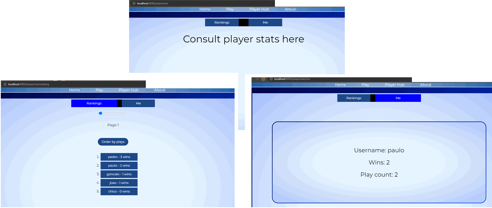
## Open games and create game
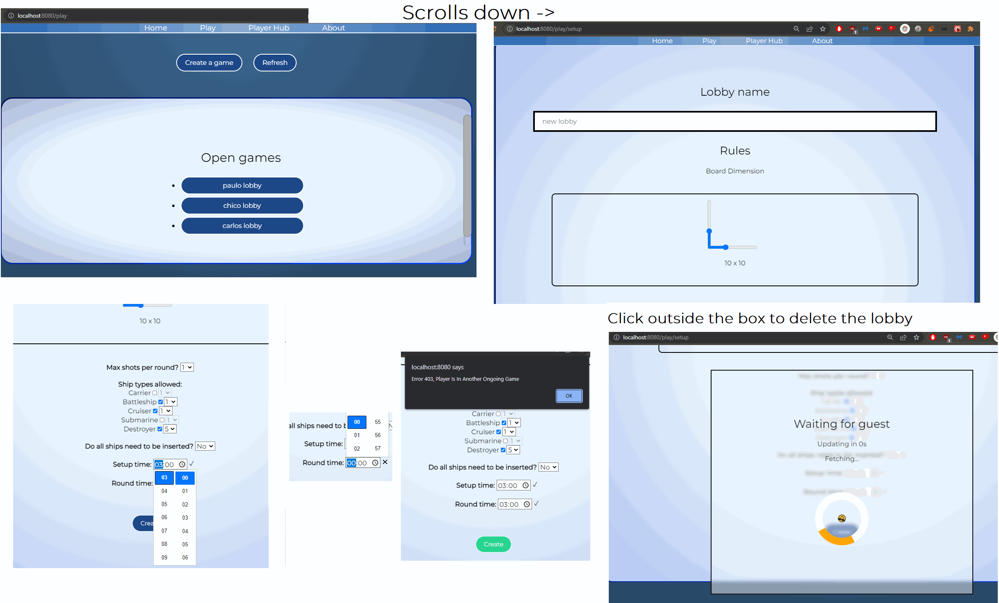
## Ships Setup
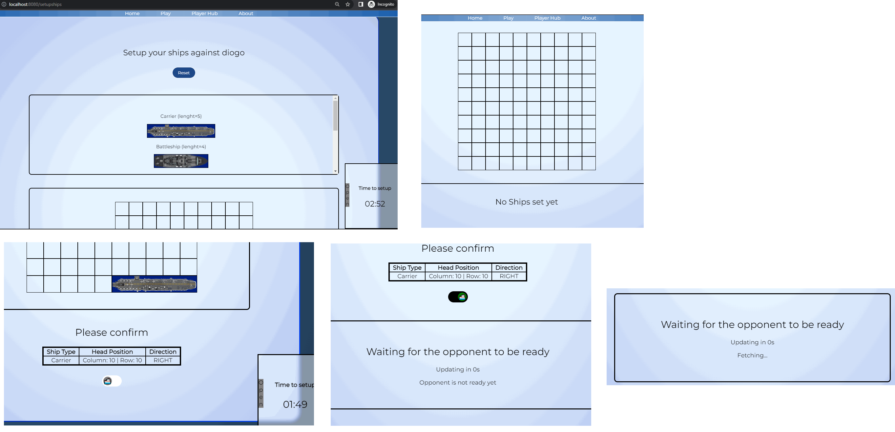
## Gameplay
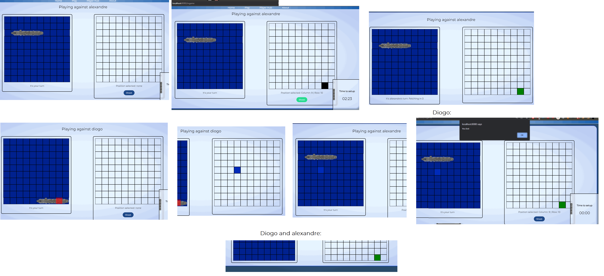

## Notes during gameplay
- Every time a users shoots a shot, it resets the TimeInterval variable in storage. And there's a cyclic operation that's made with `ScheduledExecutorService` 
- On refresh the user gets all the info it needs form the API, like the currentTimerInEffect, the users ships, the users shots, gameStatus etc
that is running for each onGoing game. It's initially started when both the users are ready
- There are some occassional errors with the synching between the timers in the server and in the front-end by up to 10s
- Neither the /shipssetup route or /ingame route supports directly accessing to it, because it depends on states injected by ReactRouter.location

## About token storage
- Neither sessionStorage or localStorage are used to store user tokens. Since that data is vulnerable to Cross Site Scripting
- Cookies are used, which won't be possible to access using Javascript (when configured as 'HttpOnly'). The browser will then only allow the use of this cookie in fetch requests.
But the problem/hack called Cross Site Requet Forjery comes into play. But using the cookie parameter 'SameSite' in the cookie avoids this